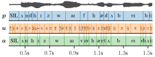

# Benchmark

<figure markdown="span" style="width: 90%">
  { width=100% }<figcaption>
  Overview of the streams in the evaluation pipeline.
  </figcaption>
</figure>

- **Languages under consideration**:
    - dev languages: German, Swahili, Tamil, Thai, Turkish, Ukrainian
    - test languages: Basque, English, French, Japanese, Mandarin Chinese, Wolof
- **Evaluation metrics**:
    - Units quality: PNMI
    - Recognition: Phone Error Rate
    - Segmentation: $F_1$, $R$-value
    - Discriminability (optional): ABX discrete and continuous
- **Tracks**
    - Many-to-one (256 units)
    - One-to-one
