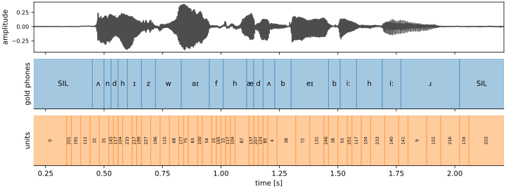
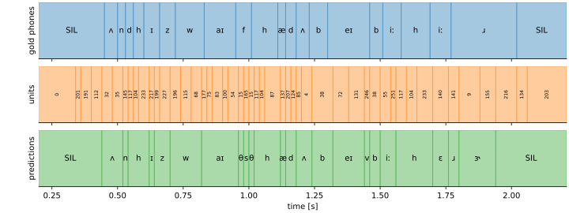
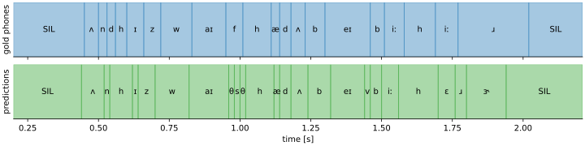
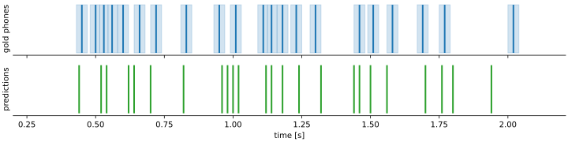
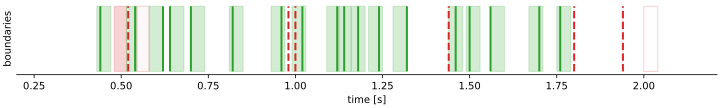
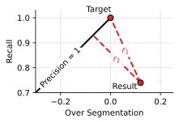

# Tasks

The benchmark evaluates discrete units against gold phone sequences through three lenses: how much phonemic
information the units carry (PNMI, ABX discriminability), how well they can be decoded into the right phones (PER),
and whether their boundaries align with phone boundaries (segmentation).

<figure markdown="span" style="width: 100%">{ width=100% }
<figcaption style="text-align: center;">Waveform, gold phones, and discrete units predicted by the model.</figcaption>
</figure>

We illustrate each step on an example from the English test set, as shown above.
The waveform is an excerpt from `0188-135249-0001.wav`, with its gold phonemic transcription and units predicted
by layer 5 of SpidR VP-20 finetuned on the 10h English split.

## Mapping units to phonemes

Let $\bm{u} = (u_1, \dots, u_T)$ be the sequence of discrete units to evaluate,
corresponding to a full dataset split, and let $\bm{p} = (p_1, \dots, p_T)$
be the corresponding sequence of gold phones, where $T$ denotes the number of
time steps at the resolution of the evaluated system. We denote by $\mathcal{P}$ the predefined set of phonemes,
and by $\mathcal{U}$ the one of units.
The empirical joint distribution of phones and units is

$$
\gdef\prob{\mathbb{P}}
\prob(i, j) = \frac{1}{T} \sum_{t=1}^T \left(p_t = i \wedge u_t = j\right), i \in \mathcal{P}, j \in \mathcal{U}.
$$

The many-to-one assignment maps each unit to its most frequent phoneme $A: j \mapsto \arg \max_{i \in \mathcal{P}} \prob(i, j)$.
The assigned sequence $\bm{a} = (\bm{a}_1, \dots, \bm{a}_T)$ is obtained by applying this mapping at each time step:
$\bm{a}_t = A(\bm{u}_t)$.

<figure markdown="span" style="width: 100%">{ width=100% }
<figcaption style="text-align: center;">Gold phones, discrete units, and many-to-one assignments.</figcaption>
</figure>

We ask participants to the benchmark to submit systems with 256 units, for fair comparison.
Setting the vocabulary size is crucial: with this setup, an unconstrained many-to-one mapping can be improved by increasing $|\mathcal{U}|$.
In the extreme case where $|\mathcal{U}| = T$ and where each unit appears exactly once, the mapping would be perfect.
A fixed vocabulary size eliminates this confound.

For the one-to-one assignment, we impose each phoneme to be mapped to a single unit: $A$ has to be a bijection.
We derive it by solving the linear assignment problem that maximizes $\prob(i, j)$ with SciPy.

## Evaluation metrics

{ width=100% }

We now evaluate the quality of the predicted sequence of phones with the following metrics.

### Units quality

The PNMI between $\bm{p}$ and $\bm{u}$ is:

$$
\text{PNMI}(\bm{p}, \bm{u}) = \frac{I(\bm{p};\bm{u})}{H(\bm{p})} =
\frac{\sum_{i,j}\prob(i, j)\log \frac{\prob(i, j)}{\prob_{\bm{p}}(i) \prob_{\bm{u}}(j)}}{\sum_i \prob_{\bm{p}}(i) \log \prob_{\bm{p}}(i)},
$$

where $\prob_{\bm{p}}(i) = \sum_{j \in \mathcal{U}} \prob(i, j)$ and $\prob_{\bm{u}}(j) = \sum_{i \in \mathcal{P}} \prob(i, j)$
are the  marginal distributions. It measures the fraction of phone entropy explained by the discrete units.

### Recognition

{ width=100% }

PNMI is sensitive both to units' quality and their alignment.
Since the mapping produces a phone sequence $\bm{a}$ from the units $\bm{u}$,
we compare it directly to the gold sequence $\bm{p}$ by computing the **PER** to abstract away from the alignment.

In this example, the minimal number of edits consists of 4 insertions, 1 deletion, and 2 substitutions, making up for
a PER of $(4 + 1 + 2) / 22 = 32\%$

### Segmentation

Recognition evaluates predicted labels but not their temporal alignment.
Segmentation evaluation is complementary: it ignores labels and only compares boundary positions.

We report $F_1$ and $\bm R$**-value**, which penalizes over-segmentation more than $F_1$:

$$
F_1 = \frac{2 \text{TP}}{2 \text{TP} + \text{FP} + \text{FN}}, \qquad \begin{aligned} R\text{-value} = & \quad 1 - \frac{r_1 + r_2}{2} \\
 = & \quad 1 - \frac{\sqrt{(1 - \text{R})^2 + \text{OS}^2} + |\frac{1-\text{R}+\text{OS}}{\sqrt{2}}|}{2} \end{aligned}
$$

with $\text{OS} = \frac{R}{P} - 1$ the over-segmentation, $R = \frac{\text{TP}}{\text{TP} + \text{FN}}$ the recall, and
$P = \frac{\text{TP}}{\text{TP} + \text{FP}}$ the precision.

We allow a tolerance of $\pm$20 ms around each gold boundary and split overlapping windows at their midpoint,
as shown below.

{ width=100% }

In this example, there are 18 true positives (green lines), 6 false positives (dashed red lines), and 3 false negatives
(red areas): $F_1 = 0.800$, $R\text{-value} = 0.798$.

{ width=100% }

 
  The $R$-value has a geometric interpretation. It represents how close the segmentation is from the ideal
  $(\text{OS}, R) = (0, 1)$ point (with distance $r_1$) and the $P = 1$ line (with $r_2$) in the $R$, $\text{OS}$ space.
 

### Discriminability

We provide utilities to optionally compute ABX discriminability on continuous representations
of triphones or discrete units, using the [fastabx library](https://github.com/bootphon/fastabx).
ABX measures whether two instances of the same triphone (e.g., /bag/) are closer to one another
in embedding space than to instances of a minimally constrasting triphone (e.g., /beg/).
On discrete units, ABX is related to PNMI but with a hard threshold for success:
two realizations of the same triphone must be encoded as the same sequence.
On continuous representations, it is a useful proxy during development to guide
pretraining and select intermediate layers with easily available phonetic information without requiring discretization.
